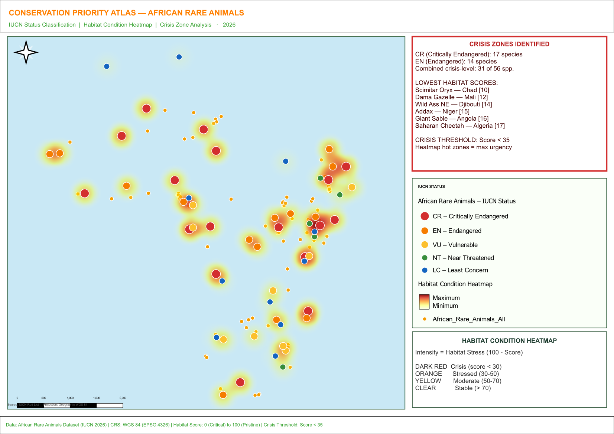

# Conservation Priority Atlas — African Rare Animals
**Version:** 1.0  |  **Date:** May 2026  |  **CRS:** WGS 84 (EPSG:4326)

---

## Project Overview

This QGIS project delivers a Conservation Priority Atlas for 56 African rare and threatened animal species, integrating IUCN Red List classification, habitat condition scoring, and spatial crisis zone analysis across the African continent.

---

## Folder Structure

```
Conservation Priority Atlas for African Rare Animals/
├── Conservation_Priority_Atlas.qgz     ← Main QGIS project (open this)
├── README.md                            ← This file
├── Analyst_Reproduction_Prompt.docx     ← 500-word guide for reproduction
├── data/
│   └── african_rare_animals.geojson    ← Primary dataset (56 species, WGS 84)
└── exports/
    ├── Conservation_Priority_Atlas.pdf  ← Print layout (A3 landscape)
    └── Conservation_Priority_Atlas_preview.png
```

---

## Layers

| Layer Name | Type | Description |
|---|---|---|
| African Rare Animals – IUCN Status | Vector (Points) | 56 species with categorized IUCN symbology |
| Habitat Condition Heatmap | Vector (Heatmap) | Kernel density weighted by habitat stress (100 − score) |

---

## IUCN Symbology Key

| Status | Color | Count | Meaning |
|---|---|---|---|
| CR – Critically Endangered | 🔴 Dark Red (#D32F2F) | 17 | Extremely high extinction risk |
| EN – Endangered | 🟠 Orange (#F57C00) | 14 | High extinction risk |
| VU – Vulnerable | 🟡 Yellow (#FBC02D) | 9 | Elevated extinction risk |
| NT – Near Threatened | 🟢 Green (#388E3C) | 5 | Close to qualifying for threatened |
| LC – Least Concern | 🔵 Blue (#1565C0) | 11 | Widespread, not at immediate risk |

---

## Dataset Schema (`african_rare_animals.geojson`)

| Field | Type | Description |
|---|---|---|
| fid | Integer | Unique feature ID |
| common_name | String | Common species name |
| species | String | Scientific binomial name |
| iucn_status | String | IUCN Red List category (CR/EN/VU/NT/LC) |
| habitat_score | Integer | Habitat condition score 0–100 (higher = better) |
| country | String | Primary range country |
| pop_est | Integer | Estimated global population |
| threat | String | Primary threats description |
| crisis_zone | Boolean | True if habitat_score < 35 (crisis threshold) |

---

## Heatmap Interpretation

The **Habitat Condition Heatmap** layer visualises conservation urgency by mapping habitat stress spatially:

- **Expression:** `100 − habitat_score` (higher = more degraded)
- **Dark Red zones** → Habitat score < 30, critical degradation, immediate intervention required
- **Orange zones** → Score 30–50, stressed ecosystems
- **Yellow zones** → Score 50–70, moderate pressure
- **Transparent areas** → Score > 70, relatively stable habitats

---

## Print Layout

The print layout **"Conservation Priority Atlas"** (A3 Landscape, 150 dpi) includes:

- Full-extent Africa map with all layers rendered
- Crisis Zone panel listing 31 species at or above crisis threshold
- IUCN Status legend (colour-coded categories)
- Heatmap legend with gradient interpretation
- Scale bar (500 km segments), footer with data source attribution

**To access:** In QGIS → Project menu → Layout Manager → Open "Conservation Priority Atlas"  
**To export:** Layout → Export as PDF / Export as Image

---

## Crisis Zones

Species with the lowest habitat scores (most urgent):

| Species | Country | Score |
|---|---|---|
| Scimitar Oryx | Chad | 10 |
| Dama Gazelle | Mali | 12 |
| African Wild Ass (NE) | Djibouti | 14 |
| Addax | Niger | 15 |
| Giant Sable Antelope | Angola | 16 |
| Saharan Cheetah | Algeria | 17 |
| Ethiopian Wolf | Ethiopia | 20 |
| Hirola | Kenya | 20 |

---

## How to Open the Project

1. Open **QGIS 3.x** (tested on QGIS 3.40 Bratislava)
2. File → Open Project → select `Conservation_Priority_Atlas.qgz`
3. All layers load automatically from the `data/` folder (relative paths)
4. To view the print layout: Project → Layout Manager → Conservation Priority Atlas

---

## Credits & Reproduction

See `Analyst_Reproduction_Prompt.docx` for a complete 500-word step-by-step guide enabling any analyst to fully reproduce this atlas from scratch using QGIS and Python/PyQGIS.

---

*Conservation Priority Atlas | African Rare Animals | 2026*

---

## Map Preview



